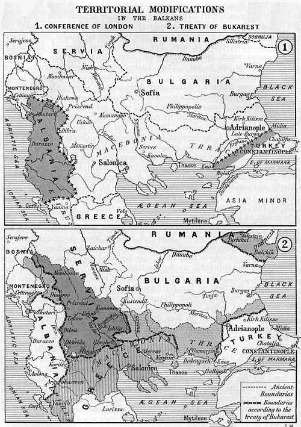

# La crisi del primato europeo

## Convivenza in Europa

* Annessione del'Alsazia e della Lorena nel 1870 alla Germania. La Francia attende la sospirata vendetta.
* Annessione della Bosnia-Erzegovina nel 1908 all'Austria-Ungheria. Gli slavi rivendicano un ruolo sociale.

## La conquista del globo

* Indebolimento della Cina con la rivolta dei boxer nel 1900.
* Theodore Roosevelt viene eletto presidente degli Stati Uniti nel 1901.
* Sconfitta della Russia contro il Giappone a Port Arthur nel 1904.

## La rivoluzione Russa

* Instaurazione della monarchia costituzionale nel 1905, a causa della pressione interna proveniente dai soviet.
* Opposizione dei partiti di maggioranza a Stolypin, tra cui menscevichi, e bolscevichi sotto la guida di Lenin.

## Il tramonto dell'impero ottomano

* Minima ripresa economica nel 1908 dopo la rivolta del movimento nazionalista dei Giovani turchi.
* Inarrestabile processo di decadenza, con la cessione del Nord Africa e dei Balcani.

## Il rimescolamento delle alleanze

* Patto segreto (1902) dell'Italia con la Francia, nonostante la Triplice alleanza (1882) con Germania e Austria.
* Triplice intesa (1907) della Gran Bretagna con la Russia, dopo l'Entente cordiale (1904) con la Francia.

### Il rimescolamento delle colonie

1. FR: Algeria, Marocco, Senegal,Tunisia, Madagascar
2. GB: Afghanistan, Egitto, Parte di Persia (Iran)
3. IT: Eritrea, Libia, Somalia
4. JP: Corea, Parte della Manciuria
5. US: Cuba, Portorico, Filippine

### Il nuovo assetto dei Balcani

1. Albania
2. Bulgaria
3. Grecia
4. Montenegro
5. Serbia
