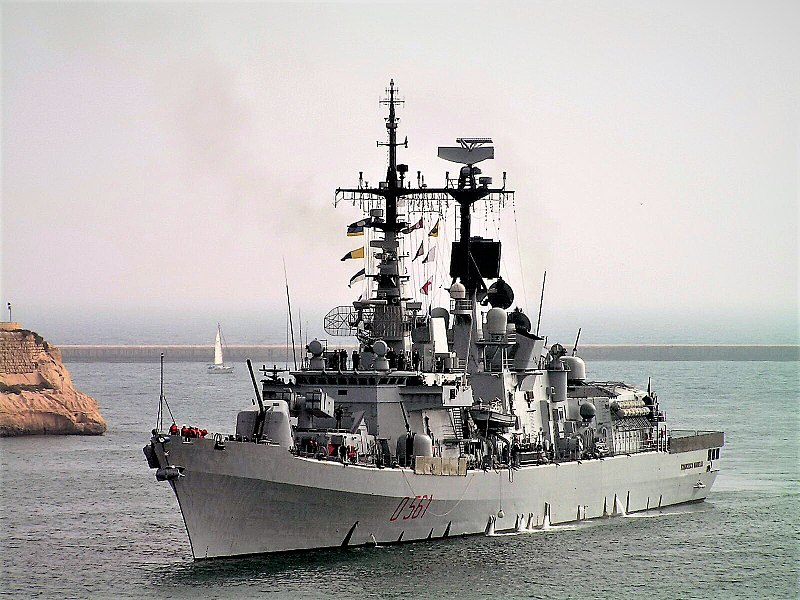

# La Prima guerra mondiale

## Una terza guerra balcanica

* Assassinio di Francesco Ferdinando a Sarajevo il 28 giugno 1914. Un mese dopo, l'Austria dichiara guerra alla Serbia.
* La Germania, in seguito alla risposta Russa, risponde a sua volta dichiarando guerra alla Russia, alla Francia e al Belgio.

## L'illusione di una rapida vittoria

* Combattimento di posizione tra Francia e Germania, sulle sponde dei fiumi Marna e Somme.
* L'Austria, alleata con Bulgaria e Turchia, occupa definitivamente la Serbia.
* La Gran Bretagna e il Giappone conquistano le colonie tedesche in Africa e Asia.

## L'intervento italiano

* L'Italia entra in guerra a fianco dell'Intesa il 24 maggio 1915, con la speranza di annettere i territori di Trento e Trieste.
* L'Austria e la Germania hanno la meglio a Caporetto nell'autunno del 1917, conquistando i territori dal fiume Isonzo al Piave.
* Cambia il governo. Armando Diaz sostituisce il generale Luigi Cadorna, scaccia gli invasori e conquista Trento e Trieste.

### Tecnologia al servizio della morte

1. Aereo
2. Artiglieria pesante
3. Mitra & Mine
4. Carro armato
5. Lanciafiamme
6. Sommergibile
7. Cacciatorpediniere
8. Gas chimici

## Carnefici e vittime sacrificali

* Arruolamento forzato di contadini e operai, i quali condividono un identità e una lingua comune vivendo insieme nelle trincee.
* Medici e psichiatri danno la caccia ai simulatori mentre le autorità puniscono i propri eserciti con la decimazione.
* Frequenti casi di nevrotici di guerra a causa delle condizioni di vita in trincea e della continuata esposizione con la morte.

## Le rivoluzioni russe del 1917

* Abdicazione dello zar Nicola II nel marzo 1917, a seguito di un insurrezione popolare. Un mese dopo, Lenin torna in Russia.
* Instaurazione della dittatura bolscevica e conquista del Palazzo d'Inverno il 25 ottobre 1917. Uscita di guerra il marzo 1918.
* Repressione del dissenso interno: il potere resta nelle mani di Lenin e Trockj, senza mai passarlo ai soviet come promesso.

## La vittoria degli Alleati

* Gli Stati Uniti entrano in guerra a fianco dell'Intesa il 4 aprile 1917, affinché l'Intesa possa restituire i prestiti concessi.
* Sconfitta degli imperi centrali dopo aver esaurito ogni risorsa. Abdicazione di Guglielmo II e Carlo I.
