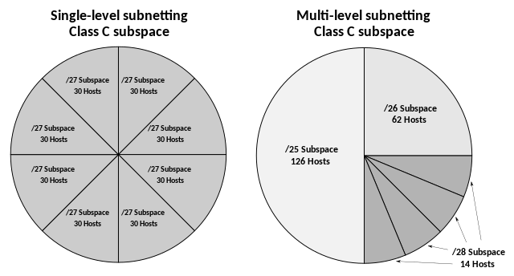

\newpage

# OSI Reference Model, Layer 3

## IPv4 datagram format

{width=75%}

+---------------------+--------+---------------------------------------------------------------+
| Header section      | Size   | Description                                                   |
+:====================+:=======+:==============================================================+
| Identification      | 2-byte | Identifies fragments of the same datagram.                    |
+---------------------+--------+---------------------------------------------------------------+
| Flags               | 03-bit | Please, refer to the next table.                              |
+---------------------+--------+---------------------------------------------------------------+
| Fragment Offset     | 13-bit | Packet must be a multiple of 8-bytes.                         |
+---------------------+--------+---------------------------------------------------------------+
| Options             | var    | Header must be a multiple of 4-bytes.                         |
+---------------------+--------+---------------------------------------------------------------+
| Data                | var    | One of the these: ICMP, TCP, UDP, ESP, AH.                    |
+---------------------+--------+---------------------------------------------------------------+

+-------+-------+------------------------------------------------------------------------------+
| Flags | Size  | Description                                                                  |
+:======+:======+:=============================================================================+
| DF    | 1-bit | Useful for testing link-layer MTU.                                           |
+-------+-------+------------------------------------------------------------------------------+
| MF    | 1-bit | Are there any more fragments left?                                           |
+-------+-------+------------------------------------------------------------------------------+

## IPv4 reassembly

To prevent link-layer fragmentation, which significantly increases the chance of a fragment going missing, the source node typically tests the path first by sending the datagram with the DF flag, using the MTU of its local physical link. If the datagram needs to be fragmented along the way to reach its destination, it'll instead get disregarded and an ICMPv4 message “Destination Unreachable” will be returned. At this point, the source node tries again using a smaller datagram size, and continues until it finds the largest MTU that can be used on the path.

Reassembly of fragments is performed by initializing a buffer and a timer specific to fragments of the same datagram. Each time a fragment arrives, it gets offset and put inside the buffer: once the buffer is fully filled and the last fragment with the MF flag unset arrives, its content can be read. If the timer expires or one fragment goes missing, the entire datagram ends up being disregarded.

## IPv4 addressing

+-------+----------------------+---------------+---------------+---------------+---------------+
| Class | Subnet mask          | Decimal       | Binary        | Networks      | Hosts         |
+:======+:=====================+:==============+:==============+:==============+:==============+
| A     | 255.0.0.0            | 0-127         | 0xxx xxxx     | $2^7-2$       | $2^{24}-2$    |
+-------+----------------------+---------------+---------------+---------------+---------------+
| B     | 255.255.0.0          | 128-191       | 10xx xxxx     | $2^{14}$      | $2^{16}-2$    |
+-------+----------------------+---------------+---------------+---------------+---------------+
| C     | 255.255.255.0        | 192-224       | 110x xxxx     | $2^{21}$      | $2^8-2$       |
+-------+----------------------+---------------+---------------+---------------+---------------+

: Total networks: 2,113,662. Total hosts: 16,843,002.

{width=75%}

## ICMPv4 header format

{width=75%}

+---------------+--------+---------------------------------------------------------------------+
| Error message | Type   | Description                                                         |
+:==============+:=======+:====================================================================+
| Destination   | 3      | - Network/Host/Protocol/Port Unreachable                            |
| Unreachable   |        | - Communication Administratively Prohibited                         |
+---------------+--------+---------------------------------------------------------------------+
| Redirect      | 5      | - Network/Host Redirect Datagrams                                   |
+---------------+--------+---------------------------------------------------------------------+
| Parameter     | 12     | - Pointer To Error In The Original Datagram                         |
| Problem       |        | - Missing Required Option Or Bad Length                             |
+---------------+--------+---------------------------------------------------------------------+

## NAT, private addresses

+----------------------------------------------+-----------------------------------------------+
| Inside/Outside address                       | Local/Global address                          |
+:=============================================+:==============================================+
| It refers to the location of the address.    | It refers to the instance of the address.     |
+----------------------------------------------+-----------------------------------------------+

+------------------------------+-------------------------------+-------------------------------+
| Traditional NAT              | Overloading NAT               | Overlapping NAT               |
+:=============================+:==============================+:==============================+
| Dynamically translates       | Dynamically translates        | Dynamically translates        |
| inside addresses.            | inside sockets.               | inside/outside addresses.     |
+------------------------------+-------------------------------+-------------------------------+

## IPSEC transport/tunnel

{width=75%}

{width=75%}

{width=75%}

+------------------------------+-------------------------------+-------------------------------+
| Security policies            | Security associations         | Security parameter index      |
+:=============================+:==============================+:==============================+
| Set of rules built into the  | Set of algorithms and keys    | Identifies a particular       |
| protocol itself.             | between devices.              | connection using SA.          |
+------------------------------+-------------------------------+-------------------------------+
