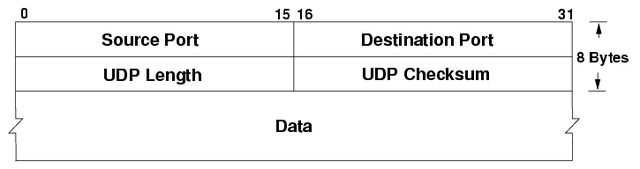
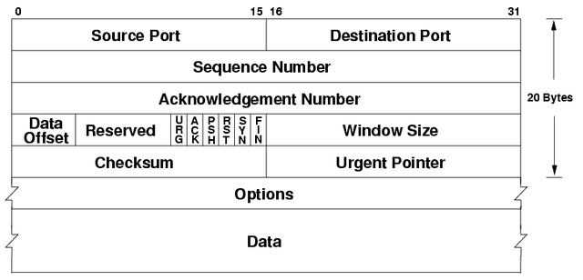

\newpage

# OSI Reference Model, Layer 4

## UDP message format

{width=75%}

### Process multiplexing

{width=50%}

+---------------+------------+-----------------------------------------------------------------+
| Ports         | Range      | Description                                                     |
+:==============+:===========+:================================================================+
| Well-known    | $2^{10}$   | Ports assigned by IANA for standard servers.                    |
+---------------+------------+-----------------------------------------------------------------+
| Registered    | $-2^{14}$  | Same as before, for non-standard servers.                       |
+---------------+------------+-----------------------------------------------------------------+
| Ephemeral     | $2^{16}$   | Ports temporarily assigned by the OS for clients.               |
+---------------+------------+-----------------------------------------------------------------+

\newpage

## TCP message format

{width=75%}

+---------------------+--------+---------------------------------------------------------------+
| Header section      | Size   | Description                                                   |
+:====================+:=======+:==============================================================+
| Option 2            | 4-byte | MSS is the equivalent of MTU $-5$ bytes.                      |
+---------------------+--------+---------------------------------------------------------------+
| Option 5            | var    | ACK for non-contiguous blocks of data.                        |
+---------------------+--------+---------------------------------------------------------------+
| Data                | var    | Stream of data, as opposed to a message.                      |
+---------------------+--------+---------------------------------------------------------------+

### Three-way handshake

{width=50%}

\newpage

### Sliding window

{width=75%}

### Problems with windows

+------------------------------+---------------------------------------------------------------+
| Problems with windows        | Description                                                   |
+:=============================+:==============================================================+
| Shrinking the windows        | Wait for the sender's usable window to empty.                 |
+------------------------------+---------------------------------------------------------------+
| Silly window syndrome        | Keep the window closed until buffer is half empty.            |
+------------------------------+---------------------------------------------------------------+

### Congestion algorithms

+------------------------------+---------------------------------------------------------------+
| Congestion algorithms        | Description                                                   |
+:=============================+:==============================================================+
| Slow start                   | Segments incrementally grow in size.                          |
+------------------------------+---------------------------------------------------------------+
| Throttling                   | Segments temporarily shrink in size.                          |
+------------------------------+---------------------------------------------------------------+
| Fast retransmit              | Segments are retransmitted for same ACK.                      |
+------------------------------+---------------------------------------------------------------+
