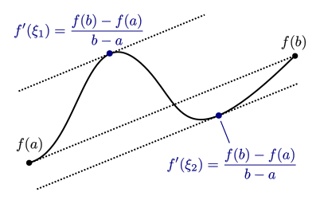

\newpage
\tableofcontents

# Teorema del valore medio di Lagrange

\newpage

## Spiegazione enunciato

> Se una funzione $f(x)$ è continua in un intervallo chiuso $[a;b]$ ed è
> derivabile in ogni punto interno a esso, esiste almeno un punto $c$ interno
> ad $[a;b]$ per cui vale la relazione: $\frac{f(b)-f(a)}{b-a} = f'(c)$.

\newpage

## Significato geometrico

{width=75%}

Come ora mai abbiamo a cuore, il significato grafico della derivata di una funzione è **il coefficiente angolare della retta tangente** in un suo punto generico. Se volessimo scrivere la funzione della retta tangente in quel punto scriveremmo: $y-y_0 = f'(x_0)\cdot(x-x_0)$. E che dire della retta secante?

Innanzitutto, ricordiamo che $f'(c)$ è in realtà un'abbreviazione per $\lim\limits_{h\to0} \frac{f(c+h)-f(c)}{h}$. In teoria dovremmo già sapere come calcolare il coefficiente angolare di una retta secante, ma siccome trattiamo di argomenti di quinta tenterò di essere più inclusivo.

Il coefficiente angolare della retta secante è dato **dal rapporto incrementale** di $f$ nel punto $c$ (o relativo a $c$). Qui è la stessa cosa, solo che al posto di $c$ il teorema usa $a$ e $b$, e al posto di $\frac{f(c+h)-f(c)}{h}$ usa $\frac{f(b)-f(a)}{b-a}$. Ancora confuso?

Consideriamo il triangolo $\overline{ABH}$, dove il punto H si trova all'intersezione dei punti $A$ e $B$. Grazie all'acronimo inglese SOH-CAH-TOA, siamo in grado di calcolare il coefficiente angolare della retta secante:

> $\tan\alpha = \frac{\overline{HB}}{\overline{AH}} = \frac{\Delta{y}}{\Delta{x}} = \frac{f(b)-f(a)}{b-a}$

Oppure, possiamo semplicemente ricordarci la formula “rise over the run”, che ci insegna che la pendenza si calcola mettendo a numeratore l'incremento verticale e a denominatore quello orizzontale.

\newpage

## Dimostrazione esempio
